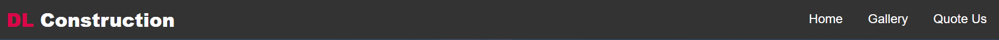
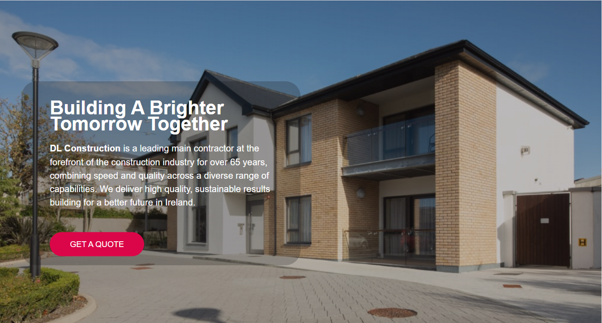
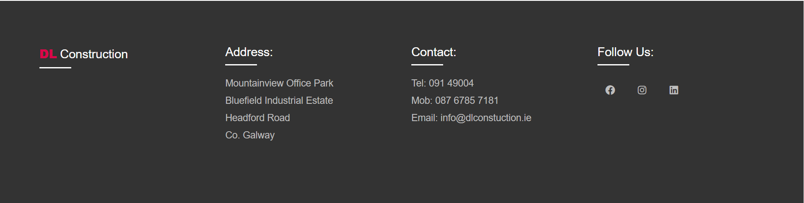
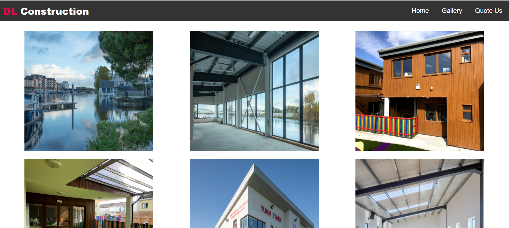
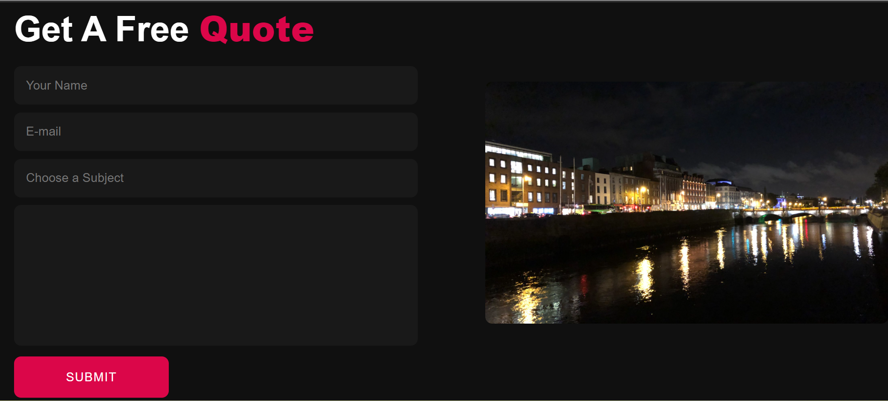

# DL Construction

This is a website for a construction company that gives the user information about the company, showcases their previous projects and provides the opportunity to contact them. The site targets users who are in the construction industry and users who may not be but need a serivice DL Construction provides.

## Contents

- [User Experience (UX)](#user-experience-ux)
    - User Stories
- [Design (UXD)](#design-uxd)
    - Strategy
    - Scope
    - Structure
    - Skeleton
    - Surface
- [Features](#features)
    - Existing Features
        - Navigation Bar
        - Landing Page Image
        - Footer
        - Gallery
        - Quote Us
    - Future Features
        - Media Slideshow
- [Testing](#testing)
    - Manual Testing
    - Validator Testing
- [Unfixed bugs](#unfixed-bugs)
- [Deployment](#deployment)
- [Credits](#credits) 
    - Content
    - Media

## User Experience (UX)
- User Stories 

    - As a new visitor:

        - I  expect to understand the aim of the site once I land on the page.
        - I Expect to navigate easily through the site and swiftly locate the content I want.
        - I expect to be able to make contact the company directly through email, telephone and other means.
        - I expect to find all information clear and comprehensive.

    - As a returning visitor:

        - I expect to find the best way to get in contact with the company with any questions I may have.

## Design (UXD)

### Strategy 

1. Is the content culturally appropriate?
    - Yes. The content of the site is focused at anyone interested obtaining the services of the company.

2. Is the content relevant?
    - Yes. The content is information given is soley about the subject matter.

3. Can we track and catalogue the content in an intuitive way?

    - Yes. We can use headers, footers, paragraphs, captions, images and links.

4. Is the technology appropriate?
    
    - Yes. The images, video and text is all relevant to what services the company provides.

5. Why would a user want this?
    - User's would want this as they are usually on this page if they are currently are about to begin a project and need a certain service that the company provides. The website is simple to understand, easy to navigate and offers an option to quickly send their enquires to the company directly.

### Scope

1. What does the user want to accomplish?
    - The user wants to be able to learn what services the company offers and an opportunity to contact the company.
2. What does the user need to do in order to achieve their objective?
    - Browse through the site, view the images, watch the accompanied video and fill out the request form.
3. What constraints does the site or app have to conform within? 
    - A time limit and the usage of HTML and CSS.

### Structure
-  Landing Page
    - Navigation bar with company name and links to the Gallery and Quote Us pages with an active page indicator.
    - Hero image with overlay text with information about the company and call to action button that directs to the contact form.
    - Footer with company name, contact details and links to the relevant social media sites.

- Gallery Page
    - Navigation bar with company name and links to the Home and Quote Us pages with an active page indicator.
    - Static images selection.
    - Embedded relevant video.
    - Footer with company name, contact details and links to the relevant social media sites.

- Quote Us Page
    - Navigation bar with company name and links to the Home and Gallery pages with an active page indicator.
    - Company contact form and submit button.
    - Footer with company name, contact details and links to the relevant social media sites.

## **Skeleton**

I created wireframes for 3 different platforms (desktop, tablet and mobile) to show responsiveness of the site. The wireframes were created using pen and paper as it's a personal preference.

View wireframes:

[Desktop: Home & Gallery](assets/images/desktop1.jpg)

[Desktop: Quote Us](assets/images/desktop2.jpg)

[Tablet: Home & Gallery](assets/images/tablet1.jpg)

[Tablet: Quote Us](assets/images/tablet2.jpg)

[Mobile](assets/images/mobile.jpg)

## **Surface**

The aim of the site is to be visially appealling, easily legible and use images and video media to compliment and give the user an enjoyable experience.

## **Features**
### **Exisiting Features**
- Navigation Bar
    - The navigation bar is fully responsive, features on all four pages and includes links to the Home, Gallery and Quote Us pages. To aid simple user navigation it is identical on each page.

    - Depending on the screen size of the user's device, the navigation bar transforms into a hamburger menu so as not to hinder the user's experience.

    

- Landing Page Image
    - The image and the text overlay easily portrays to the user that the website is for a construction company.
    - The text overlaying the image provides the user with an undertstanding of the company and it's values.
    - The call to action button allows the user to quickly re-direct themselves to the contact section of the website.
    

- The Footer
    - The footer includes the comapny's name, address and contact details.
    - All the links to the relevant social media sites are located in the footer section. Once clicked the user will simply be re-directed to their chosen destination.
    

- Gallery
    - The gallery allows the user to access images and video to showcase the company's past projects.
    - The aim of this section is to show the user the many and varied capibilites of DL Construction.

- Quote Us
    - The Quote Us section has a contact form which allows the user to send their enquires directly to the company to request an estimate of the cost involved for a project that they are planning.
    - The contact form is simple and easy to use.

### Future Features
- Media Slideshow
    - An image carousel to contain a collection of images and videos to include into the hero image section.

## Testing 
### Manual Testing
I carried out the following tests to ensure the functionality of each page, associated links & mediaa. 

I also tested that every page is fully responsive on all device sizes using chrome developer tools.

Links.

1. Test each link on the index page. Each link worked as expected, and any links leading to external pages opened correctly in a seperate browser tab.

2. Test each link on the gallery page. Each link worked as expected, and any links leading to external pages opened correctly in a seperate browser tab.

3. Test each link on the Quote Us page. Each link worked as expected, and any links leading to external pages opened correctly in a seperate browser tab.

4. Test each link on the thank you page. Each link worked as expected, and any links leading to external pages opened correctly in a seperate browser tab.

Contact Us Form.

1. Test the contact us form. I tried to submit the form without filling in any input fields. The form worked correctly and directed users to fill in the name field. I then filled in the name field and tried to submit the form. Again the form worked correctly and directed the user to fill out the email field. I filled out the name and email forms and tried to submit the form. The form worked correctly and asked the user to fill in the textarea field. I filled out the name, email and textarea field and tried to submit the form. The form then opens the thank you page in the same browser window.

2. I tried to submit the form with only an email address - the form directs the user to fill in the name field. I filled out the name and email fields and tried to submit the form. The form then directs the user to fill out the textarea field. I filled in the name, email and textarea field and submitted the form. The form then opens the thank you page in the same browser window.

3. I tried to submit the form with only the textarea field filled in. The form directs the user to fill in the name field. I filled in the name and textarea field and submitted the form. The form directs the user to fill in the email field. I filled in the name, email and textarea fields and submitted the form. The form then opens the thank you page in the same browser window.

4. I tried submitting the form without any information filled in. The form directs the user to fill in the name field. It then goes on to ask the user to complete the email and textarea fields if they are not filled out. The form can then be submitted and will open the thank you page in the same browser window.

### Validator Testing

- HTML
    - No errors were returned when passing through the official W3C validator.
    

- CSS
    - No errors were found when passing through the official (Jigsaw) validator.
    

- Lighthouse
    - Lighthouse was used to test the accessability of the website and to make sure the fonts and colors used are easily readable.
    
.png)

- Responsiveness
    - I have tested the website is responsive on all sizes of devices and that all text is easily readable.
    - I tested the page throughout my project using chrome developer tools.

## Unfixed Bugs
No reported bugs have been detected.

## Deployment
The site was deployed to GitHub pages. The steps to deploy are as follows:
1. From the github repository click on "settings" from the navigation bar.
2. Click on "pages" from navigation section on the left.
3. In the "source" section choose which branch you want to use from the dropdown menu, it will usually be the "main".
4. Select which folder you want to use, in most cases its the "/root".
5. Hit the "save" button, then wait for your site to be published.(This can take some time.)
6. When your site is ready and published the link will be above the "source" section.

Please find a link to deployed site [here](https://danny-fla.github.io/dl-construction/)

## Credits
### Media 
- The icons used in the facilities section were taken from [Font Awesome](https://fontawesome.com/).
- The fonts used for the web page were taken from [Google Fonts](https://fonts.google.com/).
- The image used for the hero image and the images in the gallery were taken from [OCC Construction](https://occo.ie/).
- The video used in the gallery was taken from YouTube.
- The image used on the Quote Us and Thank You section was taken from [The Passenger](https://the-passenger.de/2019/10/03/liffey-river-dublin/).
- The image used for the favicon was made using [favicon.io](https://favicon.io/favicon-generator/).
### Content
- The navigation bar and Javascript used was inspired by [WebDevSimplified](https://www.youtube.com/watch?v=At4B7A4GOPg).
- The contact form is inspired by [Tahmin Ahmid](https://www.youtube.com/watch?v=t_GpKEwyw1c&t=467s).