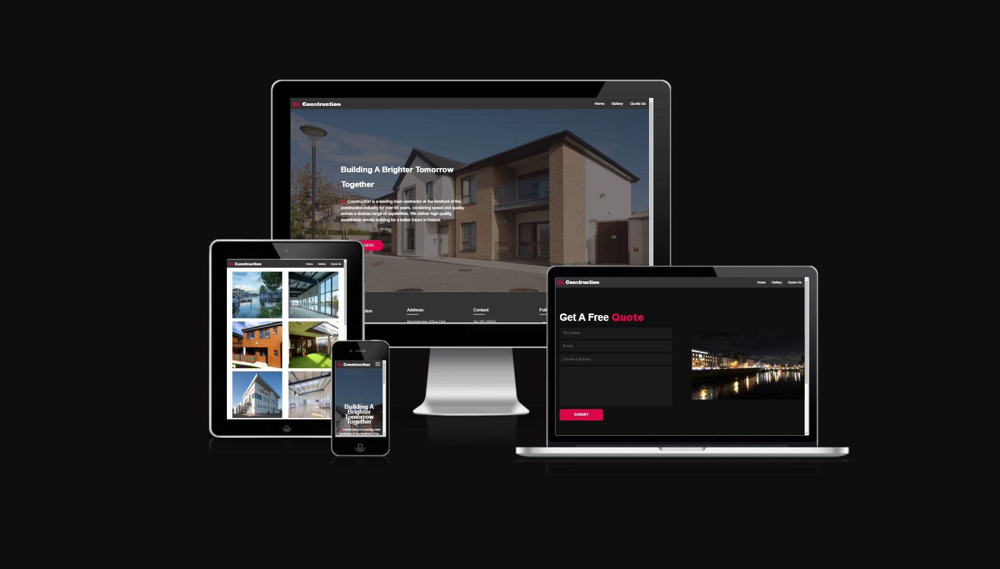
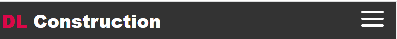
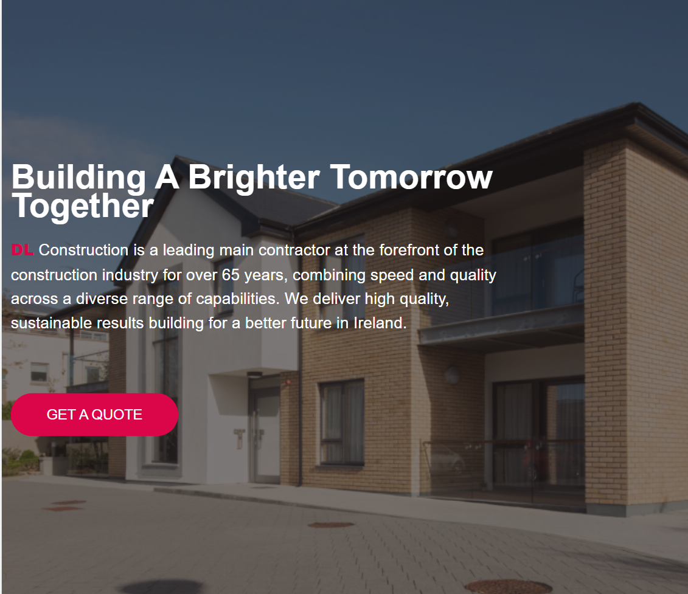

# **DL Construction**

This is a website for a construction company that gives the user information about the company, showcases their previous projects and provides the opportunity to contact them. The site targets users who are in the construction industry and users who may not be but need a serivice DL Construction provides.

<!--Add Responsive images here-->

## **Features**
### **Exisiting Features**
- **Navigation Bar**
    - The navigation bar is fully responsive, features on all four pages and includes links to the Home, Gallery and Quote Us pages. To aid simple user navigation it is identical on each page.
    <!--add navbar here-->
    - Depending on the screen size of the user's device, the navigation bar transforms into a hamburger menu so as not to hinder the user's experience.

    

- **Landing page image**
    - The image and the text overlay easily portrays to the user that the website is for a construction company.
    - The text overlaying the image provides the user with an undertstanding of the company and it's values.
    - The call to action button allows the user to quickly re-direct themselves to the contact section of the website.
    <!--add Hero here-->

- **The Footer**
    - The footer includes the comapny's name, address and contact details.
    - All the links to the relevant social media sites are located in the footer section. Once clicked the user will simply be re-directed to their chosen destination.
    <!--add footer here-->

- **Gallery**
    - The gallery provides the user with images and video to showcase the company's past projects.
    - The purpose of this section is to show to user the capibilites of DL Construction.
    <!--add gallery here-->

- **Quote Us**
    - The Quote Us section has a contact form to allow the user to send their quires to the company and obtain a cost estimate for any projects they have.
    - The contact form is important to the user as it allows them the opportunity to directly contact the company.
    <!--add contact here-->

- **Thank You**
    - The Thank You feature is a simple indicator that the user has successfully sent their request to the company.
    - This is valuable as it tells the user that they have sent their request and also that the company values their custom.
    <!--add thank you here-->

### **Future Features**
- Another Feature
## Testing 
### **Validator Testing**
- **HTML**
    - No errors were returned when passing through the official W3C validator.
    <!--add html testing here-->

- **CSS**
    - No errors were found when passing through the official (Jigsaw) validator.
    <!--add css tsting here-->

- **Lighthouse**
    - Lighthouse was used to test the accessability of the website and to make sure the fonts and colors used are easily readable.
    <!--add lighthouse here-->
- **Responsiveness**
    - I have tested the website is responsive on all sizes of devices and that all text is easily readable.
    - I tested the page throughout my project using chrome developer tools.

## **Deployment** 
The site was deployed to GitHub pages. The steps to deploy are as follows:
<!--Deployment steps here-->

## **Credits**
### **Media** 
- The icons used in the facilities section were taken from Font Awesome.
- The fonts used for the web page were got on Google Fonts.
- The image used for the hero image and the images in the gallery were taken from OCC Construction.
- The video used in the gallery was taken from YouTube.
- The image used on the Quote Us and Thank You section was taken from https://the-passenger.de/2019/10/03/liffey-river-dublin/.
- The image used for the favicon was made using https://favicon.io/favicon-generator/.
### **Content**
- The navigation bar section was inspired by WebDevSimplified.
- The contact form is inspired by https://www.youtube.com/@tahmidahmed-yt.